# BookHub

BookHub is a web application that allows users to create and manage books and authors, write and vote on reviews, create reading lists, read articles and participate in chats. It's designed to be a one-stop platform for book lovers to engage with the literary community, share their thoughts, and discover new content. It is my project for the final course of SoftUni C# Web track.

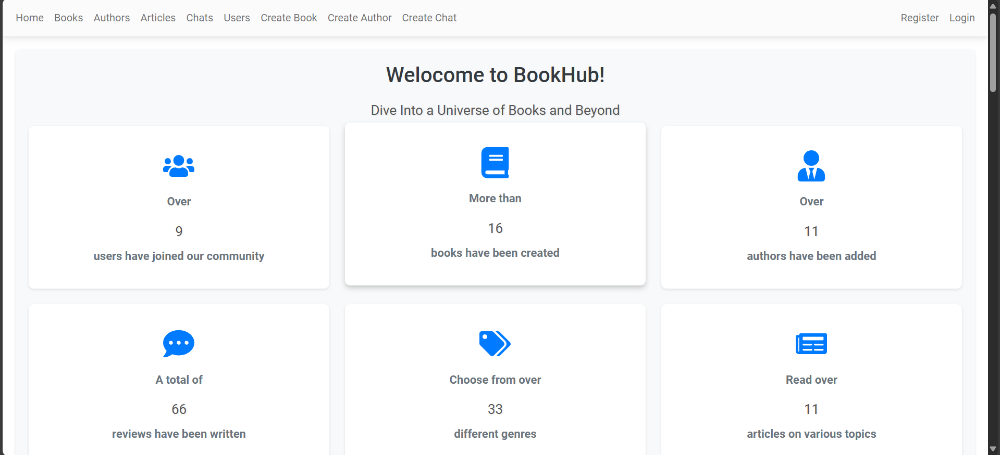

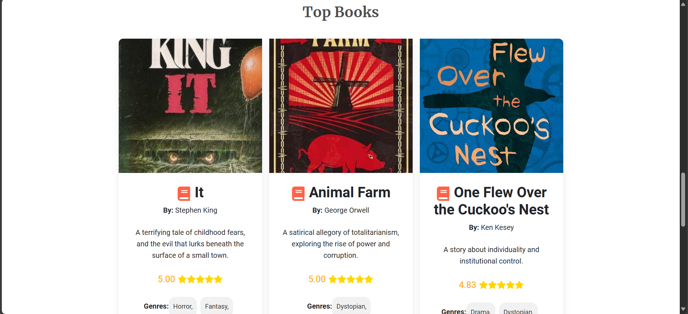

## Features

- **Identity**: Users must register with a username, email, and password. Only the home page is accessible to non-authenticated users.
- **Manage Profile**: After registration, users can configure their profile and provide additional information. Most functionalities, especially creating resources, are available only to users with a completed profile. This step is optional but recommended.
- **Create Books and Authors**: Users can add new books and authors to the platform. However, these must be approved by an admin before users can interact with them. This functionality is available only to users with a configured profile.
- **Write and Vote on Reviews**: Users can write reviews for books and vote on reviews written by others. This feature is available only to users with a configured profile.
- **Create Reading Lists**: Users can organize their favorite books into custom reading lists, categorized as "Read," "To Read," and "Currently Reading." This feature is available only to users with a configured profile.
- **Read Articles**: Users can access and read various articles related to books, authors, and literature. While users cannot create articles, no profile is required to read them.
- **Participate in Chats**: Users can create real-time discussions and invite other users to join. This feature is available only to users with a configured profile.
- **Notifications**: Users with a configured profile receive notifications for events such as: admin-approved/rejected book/author creations, chat invitations, and responses to their chat invitations (accepted/rejected).
- **Search**: Users can search for most features on the site, including books, authors, articles, and more.

## Admin Account

If you need access to admin functionality, you can use the following seeded admin account:

- **Username**: Administrator
- **Password**: admin1234

## Technologies Used

This app is built using **ReactJS** for the front-end and **ASP.NET Core Web API** for the back-end. Other technologies and libraries used include:

- **MSSQL** 
- **Entity Framework Core**
- **AutoMapper** 
- **Swagger**
- **XUnit**
- **Moq** 
- **Bootstrap** 

## Project Structure and Architecture

### Database

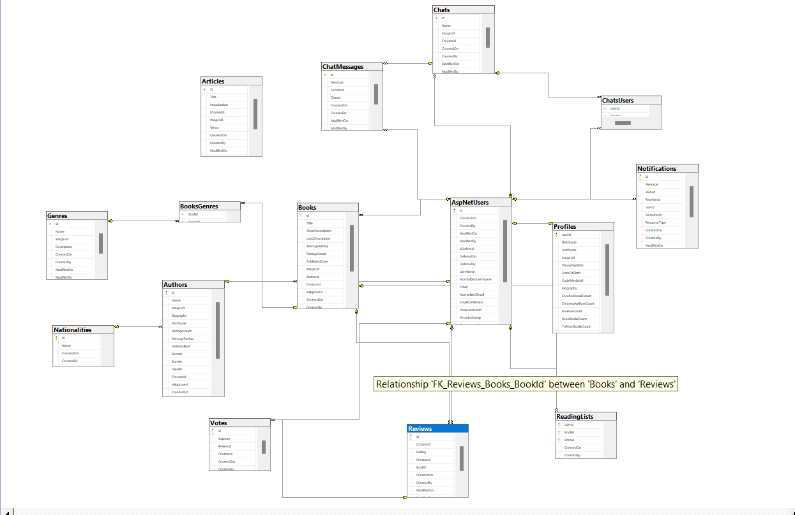

### Back-End

BookHub is a simple monolithic application using a classic 3-layered architecture: **Web**, **Service**, and **Data** layers. 

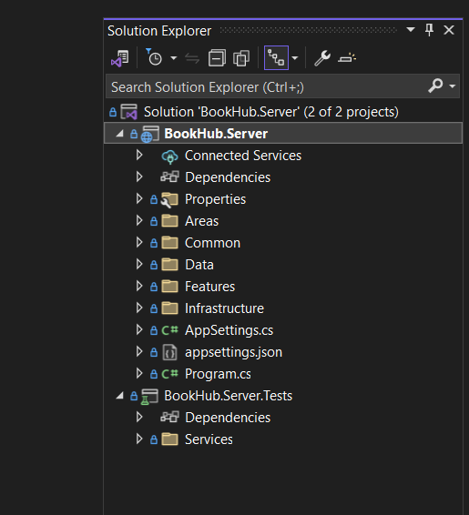

When you open the `BookHub.Server` folder, you will see the following main directories: **Areas**, **Common**, **Data**, **Features**, and **Infrastructure**. Here's an overview of each:

#### Areas

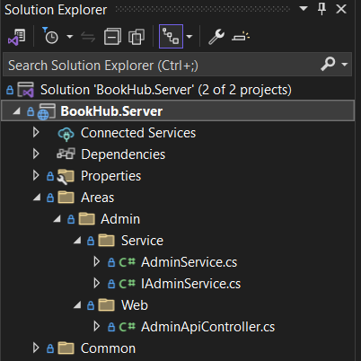

The **Areas** folder contains minimal functionality, as most features are organized under the **Infrastructure** and **Features** directories. This folder includes:
- A base controller (`AdminApiController`) that all admin-specific endpoints inherit.
- A service with a single method for retrieving the admin ID.

#### Common

The **Common** folder primarily holds:
- Constants: Used throughout various services and features.
- Custom exception (`DbEntityNotFoundException`): Shared and used by most feature services.

This directory is straightforward and includes nothing particularly unique or complex.

#### Data

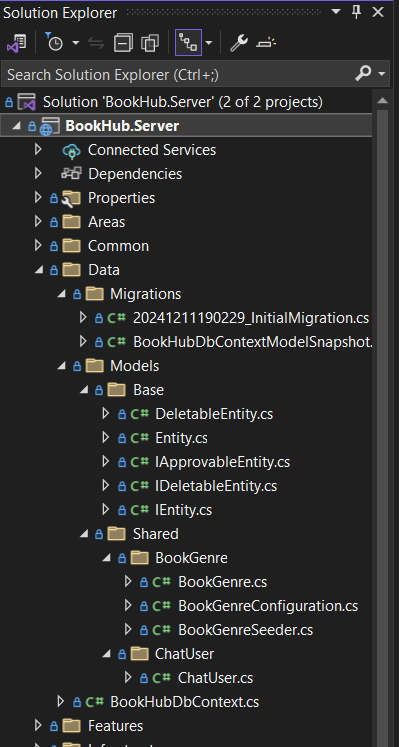

The **Data** folder contains the following key components:

- **Migrations**
- **Base**: Includes base entity classes that all database entities inherit from.
- **Shared**: Contains database entities used as mapping tables to achieve many-to-many relationships. For example, the `BookGenre` entity serves as a linking table between the `Book` and `Genre` features without belonging exclusively to either.
- **`BookHubDbContext.cs`**: Key customizations include:
  - **ApplyAuditInfo**: Ensures that all entities inheriting from the base entity class automatically include audit fields, such as:
    - Created by
    - Created on
    - Modified by
    - Modified on
  - **Global Filters**: Two global query filters are defined to handle common scenarios without requiring explicit filtering in each query:
    - **Approval Filter**: Applies to entities implementing the `IApprovableEntity` interface, automatically excluding entities where the `IsApproved` column is set to `false`.
    - **Deletion Filter**: Applies to entities implementing the `IDeletableEntity` interface, automatically excluding entities where the `IsDeleted` column is set to `true`.

These configurations streamline the application's data-handling logic, ensuring consistency and reducing redundancy in queries.

#### Infrastructure

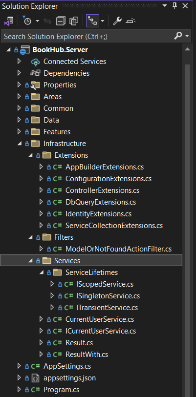

The **Infrastructure** folder centralizes application-wide services and utilities, aiming to keep the project modular and maintainable. It includes extensions, configurations, and shared functionality to reduce clutter in the `Program.cs` file. This ensures the startup configuration remains clear and concise while encapsulating related logic. Key components include:

- **Extensions**: Contains extension methods for the `IServiceCollection` and other utilities to streamline service registration and configuration. Here’s a summary of the key methods in the `ServiceCollectionExtensions` class:

  - **`AddDatabase`**: Configures the `BookHubDbContext` to use a SQL Server database with the connection string from the configuration.
  - **`AddIdentity`**: Configures ASP.NET Core Identity with custom lockout, password, and user options, and integrates it with the `BookHubDbContext`.
  - **`AddJwtAuthentication`**: Sets up JWT authentication with custom token validation parameters using a secret key.
  - **`AddSwagger`**: Adds Swagger for API documentation, defining a basic API info object.
  - **`AddServices`**: Automatically registers services by convention in the Inversion of Control (IoC) container based on their lifetimes. Service interfaces should inherit from `IScopedService`, `ISingletonService` or `ITransientService`, allowing for seamless registration without manual configuration.
  - **`AddApiControllers`**: Configures API controllers and applies global filters, such as the `ModelOrNotFoundActionFilter`.
  - **`GetAppSettings`**: Retrieves the `AppSettings` section from the configuration and registers it for dependency injection.
  - **`AddAutoMapper`**: Configures AutoMapper with mappings defined in the current assembly.

-  **Filters**: Includes `ModelOrNotFoundActionFilter`, which streamlines controller logic by automatically returning `BadRequest` for `null` results or `Ok` for valid models.

- **Services**: This folder contains service-related classes and interfaces that support various functionalities across the application. Key components include:

  - **ServiceLifetimes**: Interfaces designed to enable service registration by convention, implemented in the `ServiceCollectionExtensions`.
    - `ISingletonService`
    - `ITransientService`
    - `IScopedService`

  - **Current User Service**:
    - **`ICurrentUserService`**: Defines methods for accessing information about the current user, such as their username, ID, and admin status.
    - **`CurrentUserService`**: Implements `ICurrentUserService` by using `IHttpContextAccessor` to retrieve user details from the current HTTP context.

  - **Result Classes**:
    - **`Result`**: A utility class for handling service operation outcomes. It encapsulates a simple success/failure pattern, commonly used in logic like edit or delete operations. It can be implicitly converted from a `bool` (for success) or a string (for error messages).
    - **`ResultWith<T>`**: A generic version of `Result` that includes a data payload, allowing the return of additional information or objects when an operation succeeds.

#### Features

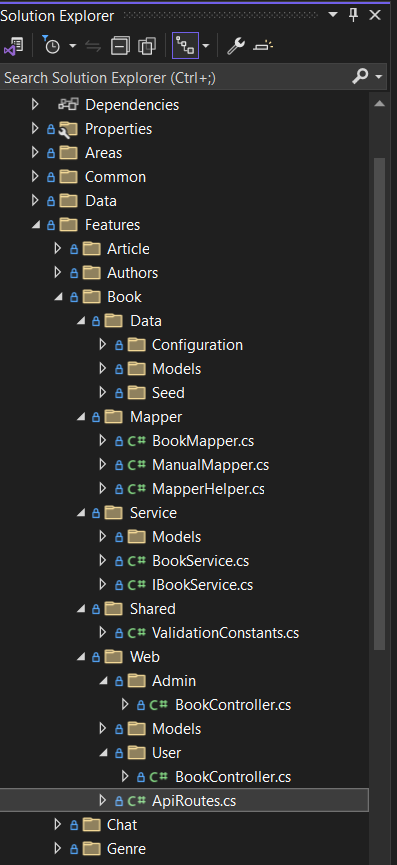

The **Features** folder contains the logic and functionality for each application feature. Inside most **Feature** folders, you will find the following structure:

- **Web**:
  - **Models**: Contains web models to handle incoming client data for `POST`/`PUT` requests. These models include validation for required properties, string lengths, and other constraints.
  - **Controllers**: Manages request/response logic for feature-specific endpoints. 
    - For admin-specific functionality (e.g., approving/rejecting books or authors), you will find separate `User` and `Admin` controllers.
    - In some cases, related but distinct entities have their own controllers. For example, in the `Author` feature, there are separate controllers for `Author` and `Author's Nationality`. Although nationalities are closely related to authors and cannot exist independently, they are separate database entities, so I use distinct endpoints.
    - When no such distinction exists, a single controller handles all requests for the feature.

- **Service**:
  - **Models**: Contains service models, which act as intermediaries between the web layer and the service layer. Incoming web models are mapped to service models before being processed to maintain separation of concerns and ensure the service layer is independent of the web layer.
  - **Service Implementation**: Includes the interface and implementation for the feature's business logic, ensuring controllers remain thin and focused. 
    - In cases of tightly coupled but distinct logic (e.g., reviews and votes), there may be multiple services for a single feature.
 
 - **Mapper**: Contains mapping profiles for AutoMapper to streamline the conversion between different models in the application layers. 
    - For complex scenarios like the `Book` feature's detailed queries, manual mapping is used in a `ManualMapper.cs` file.
    - Occasionally, helper methods in a `MapperHelper` are included for tasks like date-to-string conversions, enum parsing, etc.

- **Data**:
  - **Models**: Database models for the feature.
  - **Seed**: Seeds initial data specific to the feature.
  - **Configuration**: Handles entity configurations, reducing clutter in the `OnModelCreating` method of the `DbContext`. This often includes using `HasData()` for seeding and defining indexes where necessary.

- **Shared**:
  - Contains reusable constants such as validation rules shared between `Web` and `Data` models.

#### Tests

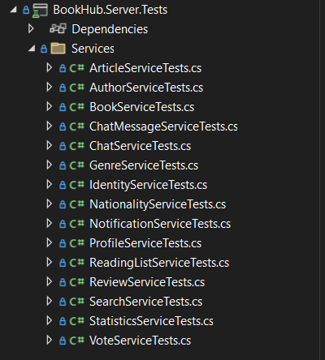

The **BookHub.Server.Tests** project contains unit tests for the business logic (services) of the application. Key points about the testing approach:

- **In-Memory Database**: I use Entity Framework's InMemory provider for testing database interactions.
- **Mocking Dependencies**: All service dependencies are mocked using Moq. For instance, the `BookService` relies on multiple services, such as `IProfileService` and `INotificationService`, which are injected as mocks.
- **Real AutoMapper**: I do not mock AutoMapper. 
- **FluentAssertions**: I use FluentAssertions for more readable and expressive test assertions.

### Front-End

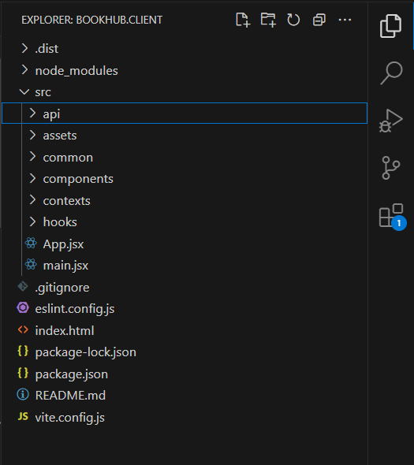

In the client-side architecture, the approach is to offload complex logic from the components into custom hooks. These hooks handle API calls using `fetch()`. As a result, most components do not contain direct logic like `useEffect()`. Instead, it is encapsulated within custom hooks such as `useBookDetails()`. The flow of logic is structured as follows: **Component** → **Custom Hook** → **Plain JavaScript File** that performs the `fetch()` calls. This design keeps the components simple and focused on rendering, while the hooks manage data fetching and logic.

When you open the `src` folder in `BookHub.Client`, you will see the following directories:

- `api`
- `assets`
- `components`
- `common`
- `contexts`
- `hooks`

### Let's walk through each one.

#### Assets

Just a couple of static images, nothing interesting here.

#### Api

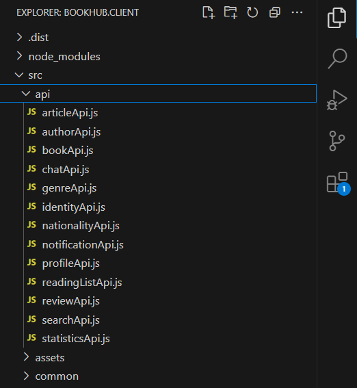

This folder contains all the files responsible for making requests to the server. Each feature listed in the Back-End section has its own corresponding file. Most of these files handle simple CRUD requests for a given resource. Typically, they:

- Receive a JWT token from the component or custom hook that calls them.
- Build the appropriate endpoint for the request.
- If the response is successful, return the data (if present) or simply return `true`.
- If the response is not successful, throw an error based on the response status or retrun `false`.

#### Common
This folder contains constants used throughout the app, such as API endpoints and error messages, and also some utility functions.

#### Components

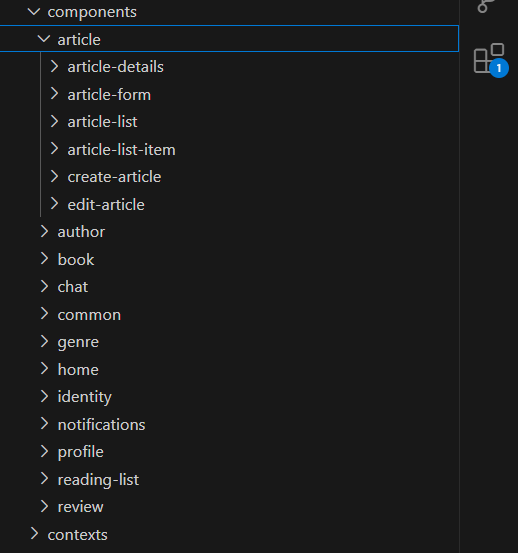

The actual `.jsx` files for each feature.

#### Contexts

This folder contains two context providers used for managing global application state: `MessageContext` and `UserContext`.

- **MessageContext**: 
  - Manages global messages displayed to the user. 
  - Provides a `showMessage` function to set the message and display it. It's used throughout the app to display success or error messages
  
- **UserContext**: 
  - Manages the authentication state and user profile information globally.
  - Stores the user's credentials, authentication status, profile completion status, and admin rights. 
  - The `UserContext` provider persists the user data in `localStorage`, so the user remains logged in after a page reload.
    - Provides functions to:
        - Change authentication state (`changeAuthenticationState`)
        - Update profile completion status (`changeHasProfileState`)
        - Log the user out and clear the stored user data from the context and `localStorage`.

#### Hooks

Custom hooks that manage logic and data fetching, which are used by the components to interact with the api.js files.

For example, instead of placing complex logic inside a component, a custom hook like `useBookDetails()` encapsulates the data fetching logic, allowing the component to simply use the hook to get the necessary data and render it.

##### `App.jsx`

Let's finally take a look at the `App.jsx` file, which is responsible for route registration and includes some custom routing logic. In the `src/components/common` folder, you will find several common `.jsx` files, including:

- **`AuthenticatedRoute.jsx`**: This component checks if the current user is authenticated using the `UserContext.jsx`. If the user is not authenticated, it redirects them to the `Login.jsx` page. If the user is authenticated, it returns the requested component, allowing access to protected routes.
  
- **`AdminRoute.jsx`**: Similar to `AuthenticatedRoute.jsx`, this component checks if the current user is an admin by using the `UserContext.jsx`. If the user is not an admin, they are redirected to the `AccessDenied.jsx` page, where a user-friendly "Unauthorized" message is displayed. If the user is an admin, the requested component is returned, granting access to admin-specific routes.

- **`ProfileRoute.jsx`**: This route is used to ensure that users have a completed profile after registration. It checks if the current user has a profile using a custom hook. If the user does not have a profile, they are redirected to the `Profile.jsx` component, where they will be prompted to complete their profile with a "Create Profile" button. If the user already has a profile, the requested component is returned.

- **`ChatRoute.jsx`**: This route checks if the current user is a participant in the requested chat. If the user is not a participant, they are redirected to the home page. If the user is a participant, the requested component (`ChatDetails.jsx`) is returned, allowing them to access the chat details.

This routing structure ensures that users can only access the parts of the app they are authorized to view, enhancing the user experience. However, it's important to note that this is not a security measure for preventing malicious actions—such checks are handled on the back-end to ensure proper security.
